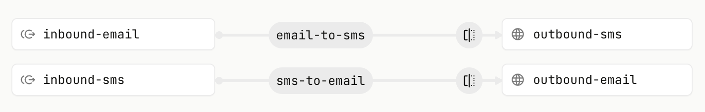
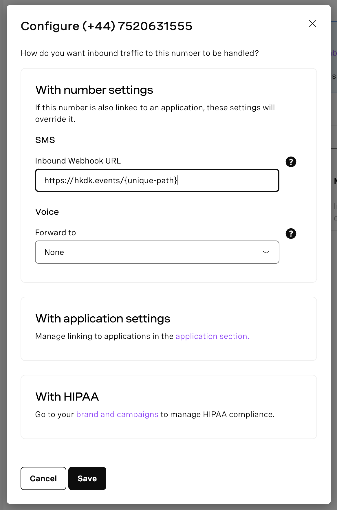
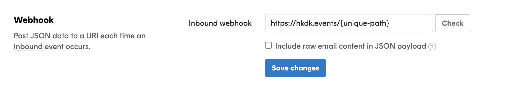

# OmniText

Have conversations across SMS and Email with [Vonage APIs](https://developer.vonage.com?ref=github-omnitext) and [Postmark](https://postmarkapp.com?ref=github-omnitext) using [Hookdeck](https://hookdeck.com?ref=github-omnitext) as a serverless message router.

## Prerequisites

- A [Hookdeck account](https://dashboard.hookdeck.com/signup?ref=github-omnitext) to handle webhooks, transform payloads, and route messages between Vonage and Postmark
- A [Vonage API account](https://developer.vonage.com/sign-up?ref=github-omnitext) to send and receive SMS. You will also need a phone number.
- A [Postmark account](https://developer.vonage.com/sign-up?ref=github-omnitext) to send and receive email
- Node.js to run the script in this repo

## Get started

Clone the repo:

```
git clone https://github.com/hookdeck/omnitext.git
cd omnitext
```

Install dependencies:

```
npm i
```

Create a `.env` file and add the required configuration:

```
cp .env-example .env
```

Update the contents as described below:

- `REPLY_TO_EMAIL`: Head to your Postmark dashboard, select your Postmark server, select the **Default Inbound Stream** -> **Settings**, and the email address is within the **Inbound** section.
- `FROM_EMAIL` and `TO_EMAIL`: Use an email address you have access to from your own domain or your own email address.
- `TO_NUMBER`: Use your own number during testing
- `FROM_NUMBER`: Within the Vonage dashboard open **Numbers** -> **Your Numbers**.
- `HOOKDECK_API_KEY`: See [Hookdeck workspace docs](https://hookdeck.com/docs/workspaces?ref=github-omnitext#api-key)
- `VONAGE_API_KEY` and `VONAGE_API_SECRET`: You'll see these credentials at the very top of the Vonage API dashboard home page.
  `POSTMARK_SERVER_API_TOKEN`: From the Postmark dashboard, select your Postmark server and then select **API Tokens**. The token is in the **Server API** section.

Run the `push.mjs` script to create two connections in Hookdeck to manage the omnichannel and omnidirectional communication between SMS via Vonage and email via Postmark:

```
node push.mjs
```

The output will be similar to the following:

```
syncing SMS to Email transformation
✅ success
syncing SMS to Email connection
✅ success
syncing Email to SMS transformation
✅ success
syncing Email to SMS connection
✅ success

Set your Vonage webhook URL for your phone number to "https://hkdk.events/{unique-path}"
Set your Postmark webhook URL for your inbound stream to "https://hkdk.events/{unique-path}"
```

Head to your workspace in Hookdeck and you will see two [connections](https://hookdeck.com/docs/connections?ref=github-omnitext) set up as follows:



Head to the Vonage Dashboard, select **Numbers** -> **Your Numbers**, and click the pencil icon under the **Manage** column for your Vonage phone number. Set the SMS Inbound Webhook URL to one indicated in the `node push.mjs` output.



Head to your Postmark dashboard, select your Postmark server, select the **Default Inbound Stream** -> **Settings**, and set your **Inbound webhook** to the one indicated in the `node push.mjs` output.



You can now:

1. Send an SMS message to the `FROM_NUMBER` (the Vonage phone number) and an email will be sent to the `TO_EMAIL`
2. Sending an email to the `REPLY_TO_EMAIL` will send an SMS message to the `TO_NUMBER`

With that, you have a conversation across SMS and email.

## Feedback and issues

Please file feedback and issues over on the [OmniText GitHub repo](https://github.com/hookdeck/omnitext/issues/new/choose).
